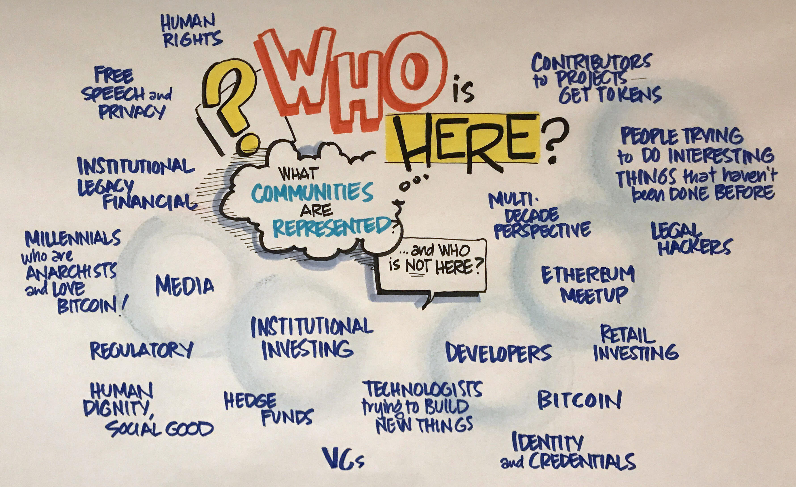
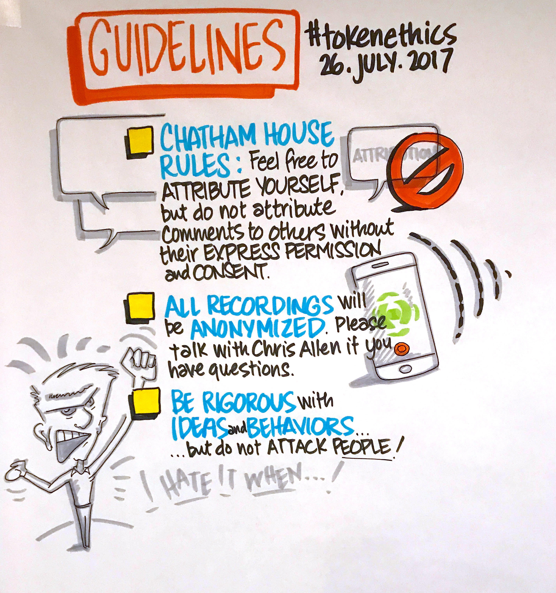
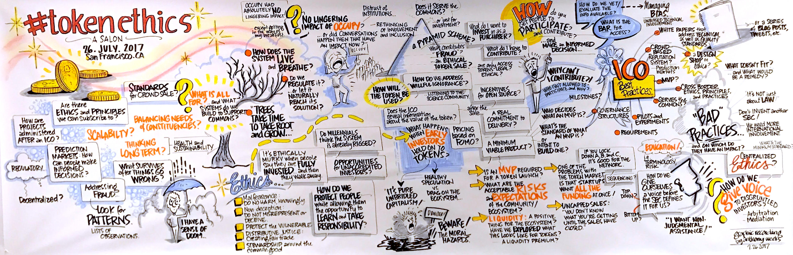

# #TokenEthics

## History of #TokenEthics

### How it started…

<blockquote class="twitter-tweet" data-lang="en" hide_thread="true" data-conversation="none">
I&#39;ve seen lots of discussions on the legality of ICOs &amp; other forms of token issuance. But how about more discussions on ethical principles?
&mdash; Christopher Allen (@ChristopherA) <a href="https://twitter.com/ChristopherA/status/885606036379287552">July 13, 2017</a></blockquote>

## Some early questions…

<blockquote class="twitter-tweet" data-lang="en" hide_thread="true" data-conversation="none">
When does ongoing creator compensation cross over from legitimately &amp; ethical incentive for innovation? How long? What %? <a href="https://twitter.com/hashtag/tokenethics?src=hash">#tokenethics</a>
&mdash; Christopher Allen (@ChristopherA) <a href="https://twitter.com/ChristopherA/status/885634913189322752">July 13, 2017</a></blockquote>

<blockquote class="twitter-tweet" data-lang="en" hide_thread="true" data-conversation="none">
I presume it can be ethical to make money. But when does creating proper incentives cross over to rent seeking? <a href="https://twitter.com/hashtag/tokenethics?src=hash">#tokenethics</a>
&mdash; Christopher Allen (@ChristopherA) <a href="https://twitter.com/ChristopherA/status/885895118053457921">July 14, 2017</a></blockquote>

<blockquote class="twitter-tweet" data-lang="en" hide_thread="true" data-conversation="none">
When does pre-mining cross over from being ethically acceptable to being  unethical? <a href="https://twitter.com/hashtag/tokenethics?src=hash">#tokenethics</a>
&mdash; Christopher Allen (@ChristopherA) <a href="https://twitter.com/ChristopherA/status/885635183403163648">July 13, 2017</a></blockquote>

<blockquote class="twitter-tweet" data-lang="en" hide_thread="true" data-conversation="none">
When does legitimate promotion ethically cross over into pump &amp; dump? <a href="https://twitter.com/hashtag/tokenethics?src=hash">#tokenethics</a>
&mdash; Christopher Allen (@ChristopherA) <a href="https://twitter.com/ChristopherA/status/885634090182991872">July 13, 2017</a></blockquote>

<blockquote class="twitter-tweet" data-lang="en" hide_thread="true" data-conversation="none">
Can HODL by early adopters cross over to being unethical? <a href="https://twitter.com/hashtag/tokenethics?src=hash">#tokenethics</a>
&mdash; Christopher Allen (@ChristopherA) <a href="https://twitter.com/ChristopherA/status/885634378767794176">July 13, 2017</a></blockquote>

<blockquote class="twitter-tweet" data-lang="en" hide_thread="true" data-conversation="none">
Is it even possible to design systems that are more ethically principled, or can every design be abused? <a href="https://twitter.com/hashtag/tokenethics?src=hash">#tokenethics</a>
&mdash; Christopher Allen (@ChristopherA) <a href="https://twitter.com/ChristopherA/status/885637200460693506">July 13, 2017</a></blockquote>

## Events

### The first Face-to-Face Salon

<blockquote class="twitter-tweet" data-lang="en" hide_thread="true" data-conversation="none">
If anyone is interested in having F2F evening roundtable in SF Bay Area on the topic of <a href="https://twitter.com/hashtag/tokenethics?src=hash">#tokenethics</a> and design (not legality!) let me know.
&mdash; Christopher Allen (@ChristopherA) <a href="https://twitter.com/ChristopherA/status/885646222844846080">July 13, 2017</a></blockquote>

<blockquote class="twitter-tweet" data-lang="en" hide_thread="true" data-conversation="none">
Currently thinking 1st <a href="https://twitter.com/hashtag/Tokenethics?src=hash">#Tokenethics</a> Roundtable July 26th in SF. Small group, Chatham House rules w/transcripts, focus on ethics not past.
&mdash; Christopher Allen (@ChristopherA) <a href="https://twitter.com/ChristopherA/status/885900718485381120">July 14, 2017</a></blockquote>

### What communities were represented at the first Salon?

### What were the guidelines for our conversation?

<blockquote style="border-style: solid;">
&ldquo;The <b>Chatham House Rule</b> reads as follows: When a meeting, or part thereof, is held under the <b>Chatham House Rule</b>, participants are free to use the information received, but neither the identity nor the affiliation of the speaker(s), nor that of any other participant, may be revealed.&rdquo;
<a  href="https://www.chathamhouse.org/about/chatham-house-rule">Chatham House Rule | Chatham House</a> <cite>https://www.chathamhouse.org/about/chatham-house-rule</cite>

</blockquote>

### What did we talk about?

(See <a href="./images/tokenethics_graphic_recording.jpg" target="_new">full-sized version</a>)

### Who financially sponsored this event?

…hosted the event space and provided dinner for the participants of the Salon.

…paid for the graphic recording artist and the first audio transcription.

Costs: ~$1700
