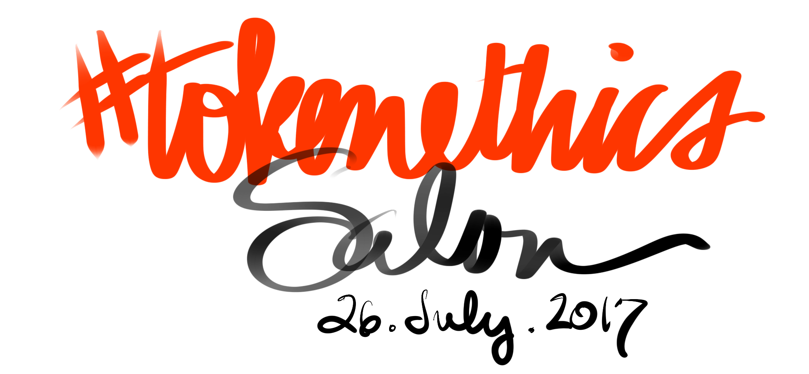
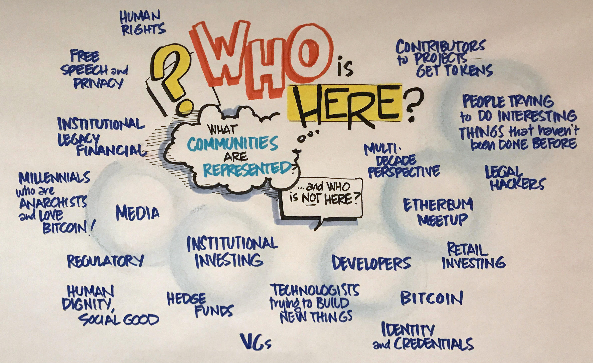
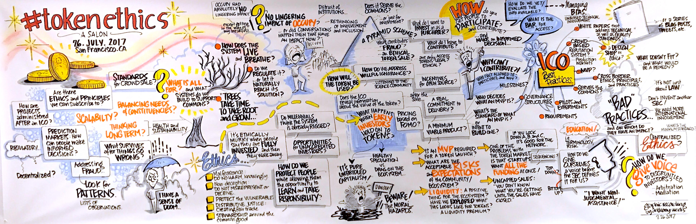
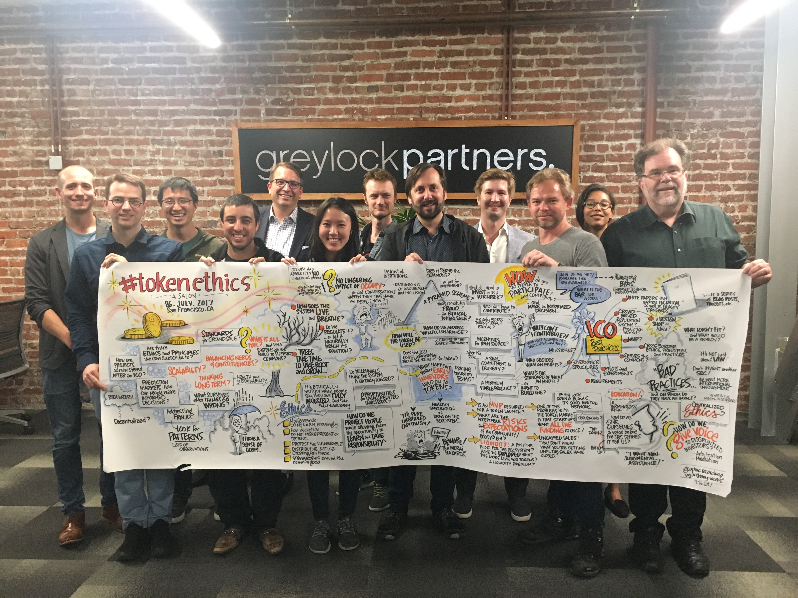

# 

<b>NEWS:</b> We had our first virtual salon on Wednesday August 30th — <a href="https://docs.google.com/document/d/15u8uuMLUPJytfbqkkYf8QTyODPD4LVSEFXxzpWJ_9Mc/edit?usp=sharing">shared notes</a> are available, with selected quotes, new open questions, and calls to action. Consensus of participants was <b>“All ICO white papers should contain (or link to) an ethical code of conduct”</b> (<a href="https://twitter.com/ChristopherA/status/902950402525609984">retweet!</a>)  

We plan to have another virtual salon in late October, timed for Asian & Australian participation. Sign up to <a href="http://eepurl.com/cYcb3j">Announcements List</a> for invite!

## History of #TokenEthics

### How it started…

<blockquote class="twitter-tweet" data-lang="en" hide_thread="true" data-conversation="none">

I&#39;ve seen lots of discussions on the legality of ICOs &amp; other forms of token issuance. But how about more discussions on ethical principles?
&mdash; Christopher Allen (@ChristopherA) <a href="https://twitter.com/ChristopherA/status/885606036379287552">July 13, 2017</a>
</blockquote>

### Some early questions…

* When does ongoing creator compensation cross over from being a legitimate &amp; ethical incentive for innovation? How long? What %?

* We presume it can be ethical to make money, but when does creating proper incentives cross over to rent seeking?

* When does pre-mining cross over from being ethically acceptable to being  unethical?

* When does legitimate promotion ethically cross over into pump &amp; dump?

* Can HODLing (holding) by early adopters cross over to being unethical?

* Is it even possible to design systems that are more ethically principled, or can every design be abused?

## Hashtag

We are using the Twitter hashtag [#TokenEvents](https://twitter.com/search?q=%23TokenEthics) to make it easier to follow the topic.

## Events

### 

<blockquote class="twitter-tweet" data-lang="en" hide_thread="true" data-conversation="none">
If anyone is interested in having F2F evening roundtable in SF Bay Area on the topic of <a href="https://twitter.com/hashtag/tokenethics?src=hash">#tokenethics</a> and design (not legality!) let me know.
&mdash; Christopher Allen (@ChristopherA) <a href="https://twitter.com/ChristopherA/status/885646222844846080">July 13, 2017</a></blockquote>

<blockquote class="twitter-tweet" data-lang="en" hide_thread="true" data-conversation="none">
Currently thinking 1st <a href="https://twitter.com/hashtag/Tokenethics?src=hash">#Tokenethics</a> Roundtable July 26th in SF. Small group, Chatham House rules w/transcripts, focus on ethics not past.
&mdash; Christopher Allen (@ChristopherA) <a href="https://twitter.com/ChristopherA/status/885900718485381120">July 14, 2017</a></blockquote>

### Our Advance Readings

We used a *[Shared Google Doc on #TokenEthics](https://docs.google.com/document/d/1rFwP_0LvAwo17ZI80jn_vE68NjrNxKrBSRPRuTEz678)* for advance readings and to share notes before our Salon event.

### What communities were represented at the first Salon?

### What were the guidelines for our conversation?

<blockquote style="border-style: solid;">
&ldquo;The <b>Chatham House Rule</b> reads as follows: When a meeting, or part thereof, is held under the <b>Chatham House Rule</b>, participants are free to use the information received, but neither the identity nor the affiliation of the speaker(s), nor that of any other participant, may be revealed.&rdquo;
<a  href="https://www.chathamhouse.org/about/chatham-house-rule">Chatham House Rule | Chatham House</a> <cite>https://www.chathamhouse.org/about/chatham-house-rule</cite>

</blockquote>

### What did we talk about?

(See <a href="./images/tokenethics_salon_2017-07-26_graphic_recording.jpg" target="new"> full-sized version</a>)

### Key Insights & Quotes

The following quotes have been reordered, organized and slightly cleaned up from the #TokenEthics Chatham Transcript.

#### About Token Sales

"If it doesn't run the product, then it's equity, right? In that case, all the equity rules should apply."

"If it's purely for speculation and no other benefit, then … it's a Ponzi."

"Part of the reason for private markets and startup investing … is because it's illiquid, right? They can't immediately pull back the money. We haven't explored what those look like for tokens, but I think there's a ton of interesting stuff there with tokens."

#### About Standardization of Token Sales

"Soon people are going to want to differentiate themselves from the clear failures that will be in the space very shortly."

"Right now, we're in a phase where there are no clear selling points of what the structure of token sales or [their] governance … look like."

"Before you try to stamp out the standardized process, you’re still pretty early in a lot of this stuff, and you just want to be careful"

"I think there are some obvious things people shouldn’t do, but otherwise innovate away"

"A couple months ago we were saying like, 'Let's create an ICO best practices checklist. This is going to help the community. It will help provide some context for making decisions.' However, once we got in the weeds of it, oh my gosh, this stuff is all going in so many different directions, so many different models right now. Look at the number of different token sales and different models people are trying. They're radically different. There's no way to solidify this and say this is what it’s going to be."

#### About Ethics

"There are some clear lines about fraud, but it's not clear that there are sharp lines of where something is ethical or unethical"

"One of the questions is how do you collectively discover or create social norms if that's what ethics are?"

"Ethics, to some degree, is a centralization, not on a specific group of people, just a centralization of standards"

#### About the Ethics of Token Sales

"If a lot of people buy into an IPO and they buy with a few hundred dollars, it's not their savings. Is it more ethical even if there are problems with that ICO, because these people have not been harmed as much …"

"If it was unethical centralized, it's still unethical decentralized"

"How do you balance protecting people who are moving into cryptocurrency while also maintaining the reason why they entered that space?"

#### About the Ethics of Viable Products

"To me, one of the crucial things when it comes to the ethics of these things is whether or not the project has a minimal viable product."

"Where do you draw the line of getting someone's opinion about technical viability and then saying this actually is fraudulent?"

#### About Fraud in Token Sales

"Obviously the number one rule is no fraud, but there are people who are even deceiving themselves."

"Quality is … doing what you say and saying what you do."

#### About Building Regulation into the System Itself

"I don’t think we as human beings can come up with where the ethical lines are drawn. The system itself should come up with them."

"I'd really like to see that the ethical ideas are managed by the system rather than something that's imposed from the legal side."

"I think that it's interesting to think about how we decentralize regulation. There's what essentially we're talking about."

"We're able to create a model that manages that regulation … how can we create frameworks for ICOs and ECU token sales that can make regulatory intervention … constantly irrelevant?

"Yes, markets will eventually thrash things out — but information is unequal, power is unequal, time scales are unequal. There is some utility to having designs that either cause friction or have the properties that we would like them to have, because I may not survive to when markets will equalize."

#### About Token Speculators

"Can the early holders of the token actually be a detriment or unethical to the system itself?"

"I only want people who are participating in the ecosystem to be in it. … for the first few years, I want people that are committed to it."

### Conclusions & Rough Consensus

Obviously, the discussion of #TokenEthics remains open, but the following ideas seemed to have rough consensus:

1. Investors in ICOs need to have enough information about the tokens to make informed decisions.

2. Token sales should have benefits for the entire community commons being created, not just the issuers and investors.

3. Token sales should have more iterative stages, like traditional investments — not raise everything in one big funding.

4. Lists of bad practices and best practices might be good next steps.

5. We would like to continue this dialog, potentially with more Salons and/or possibly a Design Workshop.

### More Open Questions…

_The following additional open questions were raised during the discussions at the Salon._

- Is the current system of financial investment rigged against regular people? Do ICOs counter that?

- Should the regulations be different for token issuance?

- How can we reveal the value of a token during an ICO?

- Where's the line between tokens required to run the system and those that are speculative?

- Generally, how can we be very explicit about the company issuing a token and its future prospects?

- If an ICO is just an idea, when do you talk about fraud?

- Does the fact that there are early holders of a token make it less useful?

- What happens when a service gets priced out for users because of speculation by token holders?

- What is the minimum viable product for an ICO?

- How do you support both speculators and users of a system?

- Should only users, not investors, be buying initial tokens?

- By what methods can we have smaller, more restrictive iterative rounds of ICO sale?

- How do we design tokens for the long term, to be resilient and long-lived for the community that invests in it?

- A libertarian ideal might be described as "There is no place for morality and ethics on the topic of Tokens Ethics. People should be responsible for their choices, no one forced you to buy a token.” Given that framing, can we still design better systems?

### Potential Token Ethics Best Practices

*Drawn from the #TokenEthics Salon in late July, 2017 with some from support from [advance readings](https://docs.google.com/document/d/1rFwP_0LvAwo17ZI80jn_vE68NjrNxKrBSRPRuTEz678) sent to all participants including Patrick E. Murphy's "[Enlightened Marketing Ethics](https://image.slidesharecdn.com/bgiedupersuasioninfluence-100206173145-phpapp02/95/tactics-of-persuasion-influence-bgiedu-47-728.jpg?cb=1267756651)", Continuation's "[Optimal Token Sales](http://continuations.com/post/161776542685/optimal-token-sales)", Vitalik Buterin's "[Analyzing Token Sale Models](http://vitalik.ca/general/2017/06/09/sales.html)", and Christopher Allen's "[A Revised 'Ostrom’s Design Principles for Collective Governance of the Commons'](http://www.lifewithalacrity.com/2015/11/a-revised-ostroms-design-principles-for-collective-governance-of-the-commons-.html)". This list has not been fully reviewed or agreed upon by all the #TokenEthics Salon participants but instead is offered as a starting point for future discussions.*

#### Disclosure Best Practices

* Provide enough information to support informed decisions; consider both the information needs of the consumer of the tokens and the investor.
* Represent your token honestly and accurately.
* Detail how the token will be used in the network.
* Suggest what the value of the token will be after a token offering.
* Reveal what percentage of all tokens the token offering represents.
   * Do not run uncapped sales; they make it impossible to calculate token quantity.
* Request external feedback to prevent self-deception; allow time for such feedback.
* Respond to knowledgeable feedback about your tokens, networks, and systems.

#### Financial Best Practices

* Keep initial sales small and limited.
* Raise funds in iterative stages, not in one big funding.
   - Do not raise more funding than is needed for continued development; token issuers are also investors and should have aligned risks.
* Release funds to developers in iterative stages.
* Make tokens available to all stakeholders, not just investors, if possible.
   * Limit investments to what the consumers can afford to lose when you allow consumers of a token to participate in an issuance.
* Maintain the same ethics in token sales that you would maintain for any financial offering.

#### Product Best Practices

* Offer a minimal viable product, or at least a route to the same.
   * Do not issue tokens solely to obtain investment.
   * Do not issue tokens based solely on an idea.
* Commit to delivery of your product.

#### Token Best Practices

* Create tokens that benefit the commons being created.
   * Consider using a lens of [Ostrom's Design Principles](http://www.lifewithalacrity.com/2015/11/a-revised-ostroms-design-principles-for-collective-governance-of-the-commons-.html) to evaluate if the token benefits all stakeholders.
   * Do not create a token that's purely for investment, with no or little other benefit; it is often better to accept the underlying crypto asset instead.
* Release the balance of the tokens when the network goes live.
   * Do not maintain a large store of unreleased tokens, unless they will be released programmatically.
* Be aware of how your token might impact the larger blockchain ecosystems.
* Consider whether all tokens should be illiquid until initial product release.
* Consider whether developer tokens should be illiquid until initial product release.
* Consider whether issuance of new tokens should be permitted after the initial offering if there is already sufficient liquidity in the system.

#### Operations Best Practices

* Say what you intend to do, and do what you said.
* Demonstrate that tokens will increase in value for investors *and* in utility for consumers; they should have ongoing use for years after their issuance.
* Support token consumer interests before token investor interests; investors should be taking the burden of risks.
* Practice informed consent during operations.
* Continue to disclose information during operations.

### Transcript

A full transcript of our conversions, edited as per Chatham-rule,  is [here](./tokenethics_salon_2017-07-26_chatham_transcript).

### Salon producer/facilitator, participants & contributors

This salon was produced and facilitated by:
* Christopher Allen ([@ChristopherA](http://twitter.com/ChristopherA)), Principal Architect - Blockstream; Host [#RebootingWebOfTrust](http://www.WebOfTrust.com)

Participants included:
* Angus Champion de Crespigny ([@anguschampion](https://twitter.com/anguschampion))
* Anonymous – representing mining community
* Anonymous – representing ethereum developer community
* Brian Kelly ([@BKBrianKelly](https://twitter.com/BKBrianKelly))
* Chris McCann ([@mccannatron](https://twitter.com/mccannatron)), Community – Greylock Partners
* Gordon Mohr ([@gojomo](https://twitter.com/gojomo), Independent Software Developer; Advisor – ZEC Corp (Zcash)
* Jehan Tremback ([@Jtremback](https://twitter.com/Jtremback)), Founder – Althea Mesh
* Kevin Kwok ([@kevinakwok](https://twitter.com/kevinakwok)), Investor – Greylock
* Linda Xie ([@ljxie](https://twitter.com/ljxie)), Product Manager – Coinbase
* Melanie Marsollier ([@M_Marsollier](https://twitter.com/M_Marsollier))
* Noah Thorp ([@noahthorp](https://twitter.com/noahthorp)), Founder – CoMakery
* Spencer Bogart ([@bitcom21](https://twitter.com/bitcom21)), Managing Director – Blockchain Capital
* Tuur Demester ([@TuurDemeester](https://twitter.com/TuurDemeester))

Additional contributors:
* Anthony Weeks ([@Weeksonian](https://twitter.com/Weeksonian)) - graphic recorder
* Shannon Appelcline ([@Appelcline](https://twitter.com/Appelcline)) - editor
* Vlad Zamfir ([@VladZamfir](https://twitter.com/VladZamfir)) - advance reading

### Who financially sponsored the first Salon event?

…hosted the event space and provided dinner for the participants of the Salon.

…paid for the graphic recording artist, first audio transcription and editor.

Total costs: ~$2100

## Wish to be involved in future events?

<!-- Begin MailChimp Signup Form -->
<link href="//cdn-images.mailchimp.com/embedcode/classic-10_7.css" rel="stylesheet" type="text/css">

<form action="//TokenEthics.us16.list-manage.com/subscribe/post?u=770bd4e56d05b0c99808a4b59&amp;id=e754fd939f" method="post" id="mc-embedded-subscribe-form" name="mc-embedded-subscribe-form" class="validate" target="_blank" novalidate>
    

    <h3>Subscribe to the #TokenEthics Announcements list…</h3>

* indicates required

	<label for="mce-EMAIL">Email Address  *
</label>
	<input type="email" value="" name="EMAIL" class="required email" id="mce-EMAIL">

	<label for="mce-FNAME">First Name </label>
	<input type="text" value="" name="FNAME" class="" id="mce-FNAME">

	<label for="mce-LNAME">Last Name </label>
	<input type="text" value="" name="LNAME" class="" id="mce-LNAME">

    <strong>Your interest in #TokenEthics… </strong>
    <ul><li><input type="checkbox" value="1" name="group[1003][1]" id="mce-group[1003]-1003-0"><label for="mce-group[1003]-1003-0">F2F Events (Salons &amp; Design Workshops)</label></li>
<li><input type="checkbox" value="2" name="group[1003][2]" id="mce-group[1003]-1003-1"><label for="mce-group[1003]-1003-1">Online Events</label></li>
<li><input type="checkbox" value="4" name="group[1003][4]" id="mce-group[1003]-1003-2"><label for="mce-group[1003]-1003-2">White Papers &amp; Documents</label></li>
</ul>

    <strong>Email Format </strong>
    <ul><li><input type="radio" value="html" name="EMAILTYPE" id="mce-EMAILTYPE-0"><label for="mce-EMAILTYPE-0">html</label></li>
<li><input type="radio" value="text" name="EMAILTYPE" id="mce-EMAILTYPE-1"><label for="mce-EMAILTYPE-1">text</label></li>
</ul>

	

		

		

	
    <!-- real people should not fill this in and expect good things - do not remove this or risk form bot signups-->
	
<input type="text" name="b_770bd4e56d05b0c99808a4b59_e754fd939f" tabindex="-1" value="">

	
<input type="submit" value="Subscribe" name="subscribe" id="mc-embedded-subscribe" class="button">

	

</form>

<!--End mc_embed_signup-->

