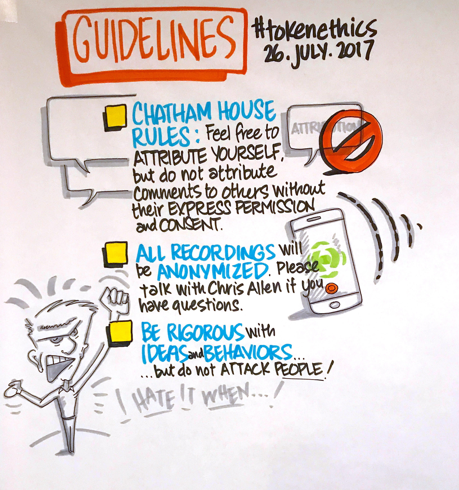
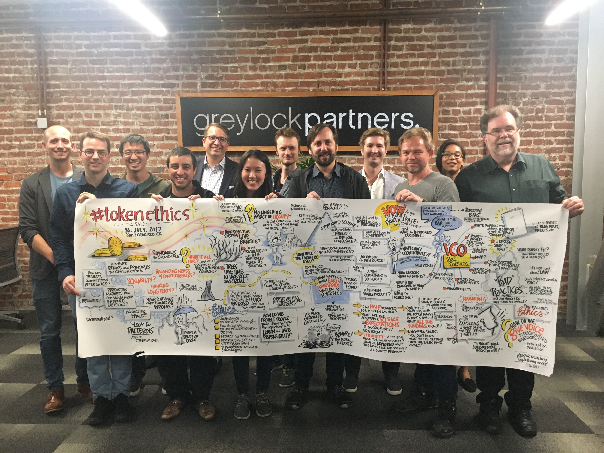

# #TokenEthics

## History of #TokenEthics

### How it started…

<blockquote class="twitter-tweet" data-lang="en" hide_thread="true" data-conversation="none">
I&#39;ve seen lots of discussions on the legality of ICOs &amp; other forms of token issuance. But how about more discussions on ethical principles?
&mdash; Christopher Allen (@ChristopherA) <a href="https://twitter.com/ChristopherA/status/885606036379287552">July 13, 2017</a></blockquote>

### Some early questions…

* When does ongoing creator compensation cross over from legitimately &amp; ethical incentive for innovation? How long? What %?

* We presume it can be ethical to make money. But when does creating proper incentives cross over to rent seeking?

* When does pre-mining cross over from being ethically acceptable to being  unethical?

* When does legitimate promotion ethically cross over into pump &amp; dump?

* Can HODL by early adopters cross over to being unethical?

* Is it even possible to design systems that are more ethically principled, or can every design be abused?

## Events

### The first face-to-face Salon on July 26, 2017

<blockquote class="twitter-tweet" data-lang="en" hide_thread="true" data-conversation="none">
If anyone is interested in having F2F evening roundtable in SF Bay Area on the topic of <a href="https://twitter.com/hashtag/tokenethics?src=hash">#tokenethics</a> and design (not legality!) let me know.
&mdash; Christopher Allen (@ChristopherA) <a href="https://twitter.com/ChristopherA/status/885646222844846080">July 13, 2017</a></blockquote>

<blockquote class="twitter-tweet" data-lang="en" hide_thread="true" data-conversation="none">
Currently thinking 1st <a href="https://twitter.com/hashtag/Tokenethics?src=hash">#Tokenethics</a> Roundtable July 26th in SF. Small group, Chatham House rules w/transcripts, focus on ethics not past.
&mdash; Christopher Allen (@ChristopherA) <a href="https://twitter.com/ChristopherA/status/885900718485381120">July 14, 2017</a></blockquote>

### What communities were represented at the first Salon?

### What were the guidelines for our conversation?

<blockquote style="border-style: solid;">
&ldquo;The <b>Chatham House Rule</b> reads as follows: When a meeting, or part thereof, is held under the <b>Chatham House Rule</b>, participants are free to use the information received, but neither the identity nor the affiliation of the speaker(s), nor that of any other participant, may be revealed.&rdquo;
<a  href="https://www.chathamhouse.org/about/chatham-house-rule">Chatham House Rule | Chatham House</a> <cite>https://www.chathamhouse.org/about/chatham-house-rule</cite>

</blockquote>

### Our Advance Readings

We used a [Google Doc](https://docs.google.com/document/d/1rFwP_0LvAwo17ZI80jn_vE68NjrNxKrBSRPRuTEz678) for advance readings and to share notes before our Salon event.

### What did we talk about?

(See <a href="./images/tokenethics_salon_2017-07-25_graphic_recording.jpg" target="new"> full-sized version</a>)

### Salon producer/facilitator, participants & contributors

This salon was produced and facilitated by:
* Christopher Allen ([@ChristopherA](http://twitter.com/ChristopherA)), Principal Architect - Blockstream; Host #RebootingWebOfTrust

Participants included:
* Angus Champion de Crespigny ([@anguschampion](https://twitter.com/anguschampion))
* Anonymous – representing mining community
* Anonymous – representing ethereum developer community
* Brian Kelly ([@BKBrianKelly](https://twitter.com/BKBrianKelly))
* Chris McCann ([@mccannatron](https://twitter.com/mccannatron)), Community – Greylock Partners
* Gordon Mohr ([@gojomo](https://twitter.com/gojomo), Independent Software Developer; Advisor – ZEC Corp (Zcash)
* Jehan Tremback ([@Jtremback](https://twitter.com/Jtremback)), Founder – Althea Mesh
* Kevin Kwok ([@kevinakwok](https://twitter.com/kevinakwok)), Investor – Greylock
* Linda Xie ([@ljxie](https://twitter.com/ljxie)), Product Manager – Coinbase
* Melanie Marsollier ([@M_Marsollier](https://twitter.com/M_Marsollier))
* Noah Thorp ([@noahthorp](https://twitter.com/noahthorp)), Founder – CoMakery
* Spencer Bogart ([@bitcom21](https://twitter.com/bitcom21)), Managing Director – Blockchain Capital
* Tuur Demester ([@TuurDemeester](https://twitter.com/TuurDemeester))

Additional contributors:
* Anthony Weeks ([@Weeksonian](https://twitter.com/Weeksonian)) - graphic recorder
* Shannon Appelcline ([@Applecline](https://twitter.com/Applecline)) - editor
* Vlad Zamfir ([@VladZamphir](https://twitter.com/VladZamphir)) - advance reading

### Who financially sponsored the first Salon event?

…hosted the event space and provided dinner for the participants of the Salon.

…paid for the graphic recording artist, first audio transcription and editor.

Total costs: ~$2100

## Wish to be involved in future events?

### Announcements List

<!-- Begin MailChimp Signup Form -->
<link href="//cdn-images.mailchimp.com/embedcode/classic-10_7.css" rel="stylesheet" type="text/css">

<form action="//TokenEthics.us16.list-manage.com/subscribe/post?u=770bd4e56d05b0c99808a4b59&amp;id=e754fd939f" method="post" id="mc-embedded-subscribe-form" name="mc-embedded-subscribe-form" class="validate" target="_blank" novalidate>
    

	<h2>Subscribe to the #TokenEthics Announcements list…</h2>

* indicates required

	<label for="mce-EMAIL">Email Address  *
</label>
	<input type="email" value="" name="EMAIL" class="required email" id="mce-EMAIL">

	<label for="mce-FNAME">First Name </label>
	<input type="text" value="" name="FNAME" class="" id="mce-FNAME">

	<label for="mce-LNAME">Last Name </label>
	<input type="text" value="" name="LNAME" class="" id="mce-LNAME">

    <strong>Your interest in #TokenEthics… </strong>
    <ul><li><input type="checkbox" value="1" name="group[1003][1]" id="mce-group[1003]-1003-0"><label for="mce-group[1003]-1003-0">F2F Events (Salons &amp; Design Workshops)</label></li>
<li><input type="checkbox" value="2" name="group[1003][2]" id="mce-group[1003]-1003-1"><label for="mce-group[1003]-1003-1">Online Events</label></li>
<li><input type="checkbox" value="4" name="group[1003][4]" id="mce-group[1003]-1003-2"><label for="mce-group[1003]-1003-2">White Papers &amp; Documents</label></li>
</ul>

    <strong>Email Format </strong>
    <ul><li><input type="radio" value="html" name="EMAILTYPE" id="mce-EMAILTYPE-0"><label for="mce-EMAILTYPE-0">html</label></li>
<li><input type="radio" value="text" name="EMAILTYPE" id="mce-EMAILTYPE-1"><label for="mce-EMAILTYPE-1">text</label></li>
</ul>

	

		

		

	
    <!-- real people should not fill this in and expect good things - do not remove this or risk form bot signups-->
    
<input type="text" name="b_770bd4e56d05b0c99808a4b59_e754fd939f" tabindex="-1" value="">

    
<input type="submit" value="Subscribe" name="subscribe" id="mc-embedded-subscribe" class="button">

    

</form>

<!--End mc_embed_signup-->
